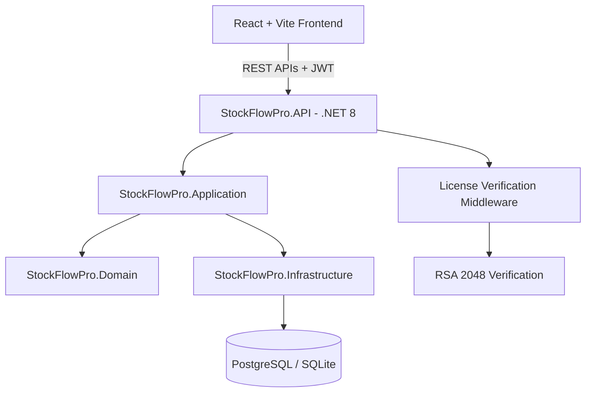

# StockFlow Pro 🚀

[](https://github.com/khanous-ilyes/PRS)
[](https://dotnet.microsoft.com/)
[](https://react.dev/)
[](https://www.typescriptlang.org/)
[](#hardware-licensing--security)

**StockFlow Pro** is an enterprise-grade, hybrid **Point of Sale (POS) and Inventory Management System**. Designed for single-store retail businesses, multi-branch operations, and offline desktop deployments, StockFlow Pro provides a high-performance, robust, and beautiful experience for inventory tracking, invoicing, client/supplier ledger management, role-based access control, and business analytics.

---

## ✨ Key Features

### 📦 Inventory & Stock Management
- **Real-time Stock Tracking**: Automatic stock level updates upon purchase orders or sales transactions.
- **Category & Variant Management**: Flexible product categorizations with unit price management and low-stock alerts.
- **Stock Movement Logs**: Granular tracking of inventory inflows, outflows, and audit trails.

### 🧾 Invoicing & Sales Operations
- **POS Checkout Interface**: Ultra-fast, responsive point-of-sale workflow tailored for cashiers and retail staff.
- **PDF Invoice Generation**: Instant client invoice generation and export with custom branding.
- **Credit & Debt Ledger**: Multi-currency ledger for client unpaid balances and supplier payments.

### 👥 User Roles & Security (RBAC)
- **Granular Permissions**: Three distinct security levels (`TenantAdmin`, `Manager`, `Cashier`).
- **Protected Actions**: Manager password prompts for sensitive actions (discounts, voiding sales, deleting stock).
- **Multi-Tenant Architecture**: Complete data isolation using EF Core Global Query Filters.

### 🔒 Hardware Licensing (Offline Mode)
- **Machine Identification**: SHA-256 fingerprinting using hardware parameters (CPU ID, BIOS Serial Number, BaseBoard Serial Number).
- **RSA-2048 Digital Signatures**: Secure offline license activation using asymmetric cryptography.
- **Zero-Cloud Dependency**: Runs completely offline without requiring internet connectivity after activation.

### 📊 Analytics & Reporting
- **Revenue & Expense Reports**: Interactive graphs powered by Recharts.
- **Export Capabilities**: Excel (XLSX) and PDF data exports for external bookkeeping.

---

## 🏗️ Architecture & Tech Stack



### **Backend (.NET 8 Clean Architecture)**
- **API Framework**: ASP.NET Core Web API with JWT Bearer Authentication.
- **Data Access**: Entity Framework Core with PostgreSQL (Supabase) / SQLite.
- **Domain Logic**: Clean Architecture separating Domain Entities, DTOs, and Interfaces.
- **Licensing Tool**: Dedicated RSA key pair generation and signature issuing CLI tool.

### **Frontend (Modern React)**
- **UI Framework**: React 19, TypeScript, TailwindCSS, Lucide Icons.
- **State Management**: Zustand for auth & global state, TanStack Query for API caching.
- **Localization**: `i18n` with multi-language support (English, French, Arabic).
- **Desktop Runtime**: Packaged as a standalone single-file Windows executable (`.exe`).

---

## 🚀 Getting Started

### Prerequisites
- [.NET 8.0 SDK](https://dotnet.microsoft.com/download/dotnet/8.0)
- [Node.js 20+](https://nodejs.org/)
- PostgreSQL or SQLite

### 1. Backend Setup

```bash
# Clone the repository
git clone https://github.com/khanous-ilyes/PRS.git
cd PRS/src/StockFlowPro.API

# Restore dependencies & run migrations
dotnet restore
dotnet ef database update

# Start the Web API
dotnet run
```

The API will be available at `http://localhost:5000` (or configured HTTP port).

### 2. Frontend Setup

```bash
# Navigate to frontend directory
cd PRS/frontend

# Install dependencies
npm install

# Start local development server
npm run dev
```

Open `http://localhost:5173` in your browser.

---

## 🔑 Offline License Activation Flow

When running in **Offline Mode** (`AppMode: "Offline"` in `appsettings.json`):

1. **First Launch**: The application detects a missing or invalid `license.key` file and redirects to `/activate`.
2. **Machine ID Copy**: The UI generates and displays a hardware machine fingerprint (e.g., `MACH-A1B2-C3D4-E5F6`).
3. **Key Generation**: The administrator uses `StockFlowPro.LicenseGenerator.exe` alongside their private RSA key to sign the Machine ID and create a valid license token.
4. **Activation**: The user pastes the license token in the UI. The app verifies the signature using the embedded public key, writes `license.key` to disk, and unlocks full functionality.

---

## 🛠️ Building Standalone Executables

To package StockFlow Pro as a standalone Windows executable:

```powershell
# 1. Build the React frontend
cd frontend
npm run build

# 2. Copy dist assets to API wwwroot
Copy-Item -Path "dist\*" -Destination "..\src\StockFlowPro.API\wwwroot" -Recurse -Force

# 3. Publish single-file executable
dotnet publish ..\src\StockFlowPro.API\StockFlowPro.API.csproj -c Release -r win-x64 --self-contained true -p:PublishSingleFile=true -o ..\dist_app
```

---

## 📄 License & Credits

Developed with ❤️ by **Ilyas Khanous**.  
All rights reserved. Designed for professional retail & business operations.
